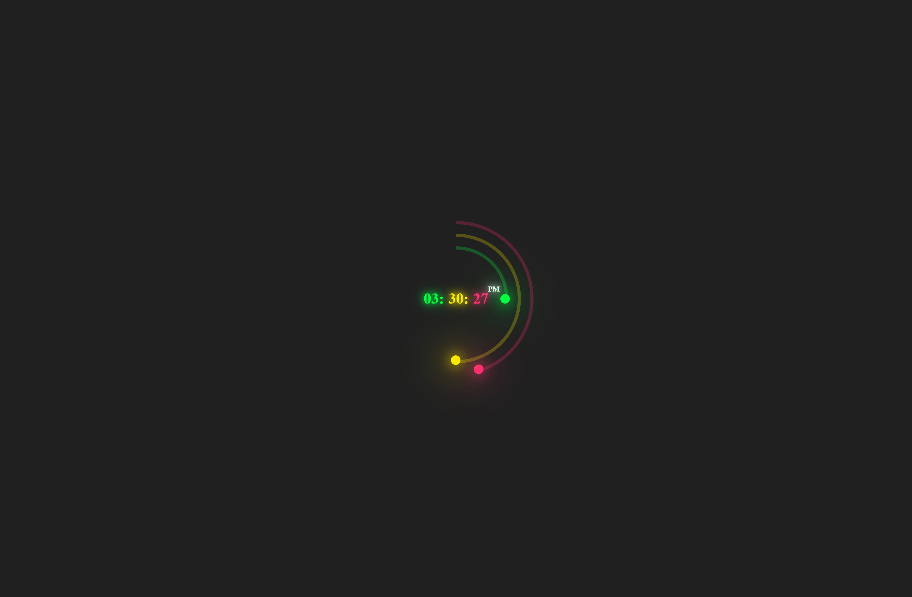

#Progress Clock
Treinando JavaScript, HTML e CSS

Um relógio com um progresso luminoso para observar o tempo passar. 

## 🚀 Sobre mim
Estudante de ADS (Análise e Desinvolvimento de Sistemas) focado em Front-end

## Stack utilizada

**Front-end:** HTML - CSS - JAVASCRIPT

[🔗Clique Aqui  para acessar](
https://douglasliman.github.io/clock/
)

## Screenshots

